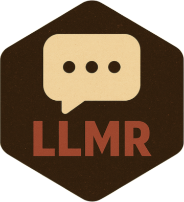

# LLMR 

[](https://CRAN.R-project.org/package=LLMR)
[](https://cran.r-project.org/package=LLMR)
[](https://opensource.org/licenses/MIT)
[](https://github.com/asanaei/LLMR/actions)
[](https://asanaei.github.io/LLMR/)

LLMR supplies a common provider interface for language-model studies in R.
One `llm_config()` object separates provider and model settings from the study
code. The same interface supports single calls, tidy data-frame operations,
multi-model experiments, and call records for replication and reporting.

**Providers:** OpenAI, Anthropic, Gemini (including Vertex), Groq, Together,
DeepSeek, xAI, OpenRouter, Voyage, Ollama, Xiaomi MiMo, Alibaba (Qwen), Zhipu,
and Moonshot.

## What LLMR does for a study

LLMR treats a model call as one part of a study workflow. You can apply one
measurement instruction across rows, compare providers or conditions with a
factorial design, repeat stochastic measurements, and retain the request,
response, settings, status, timing, and token counts for each call. Results are
data frames that can enter the rest of an R analysis.

## Install and configure a provider

```r
install.packages("LLMR")
# remotes::install_github("asanaei/LLMR")
```

Store keys in environment variables such as `GROQ_API_KEY`, `OPENAI_API_KEY`,
or `ANTHROPIC_API_KEY`, commonly in `~/.Renviron`. `llm_config()` reads the
provider's variable, so the key need not appear in the analysis code.

```r
library(LLMR)

cfg <- llm_config(
  "groq", "openai/gpt-oss-20b",
  temperature = 0.2,
  max_tokens = 256
)
```

## Apply a model to data

`llm_mutate()` evaluates a glue-style instruction for each row and appends the
response and diagnostic columns.

```r
reviews <- data.frame(
  id = 1:3,
  text = c("Clear and useful.", "It failed twice.", "The result was adequate.")
)

review_labels <- reviews |>
  llm_mutate(
    sentiment = "Classify {text} as positive, negative, or neutral. One word.",
    .config = cfg
  )
```

For a vector, `llm_fn()` uses `{x}` as the value in the instruction.

```r
labels <- llm_fn(
  reviews$text,
  "Classify {x} as positive, negative, or neutral. One word.",
  .config = cfg,
  .return = "text"
)
```

## Run comparative experiments at scale

`build_factorial_experiments()` crosses model configurations, instruction
conditions, system messages, and repetitions. It preserves labels for each
factor. `call_llm_par()` runs the design and returns an `llmr_experiment` data
frame with responses, status fields, timing, and token counts.

```r
cfg_openai <- llm_config(
  "openai", "gpt-4.1-nano",
  temperature = 0.2,
  max_tokens = 256
)

experiments <- build_factorial_experiments(
  configs = list(cfg, cfg_openai),
  config_labels = c("groq", "openai"),
  user_prompts = c(
    "Classify: The service was adequate.",
    "Assign a sentiment label to: The service was adequate."
  ),
  user_prompt_labels = c("classify", "assign"),
  system_prompts = "Return positive, negative, or neutral.",
  repetitions = 3
)

results <- call_llm_par(experiments, max_workers = 4, progress = TRUE)
```

For designs built in stages, `call_llm_compare()` compares configurations,
`call_llm_sweep()` varies generation settings, and `llm_par_resume()` reruns
failed or incomplete rows. See [Small experiment with
LLMR](https://asanaei.github.io/LLMR/articles/experiments.html).

## Record, replicate, and report a study

Logging records calls made by single, tidy, chat, and parallel interfaces in a
JSONL file. `llm_log_read()` returns the stored records and a manifest with
request and record hashes.

```r
log_path <- tempfile(fileext = ".jsonl")
llm_log_enable(log_path)

results <- call_llm_par(experiments, max_workers = 4)

llm_log_disable()
call_log <- llm_log_read(log_path)
call_log$manifest

llm_usage(results)
llm_failures(results)
report(results, task = "to compare sentiment instructions")
```

Repeated measurements require a configuration that permits sampling.
`llm_replicate()` adds one column per repetition, and `llm_agreement()`
summarizes per-row agreement and overall reliability.

```r
replicated <- reviews |>
  llm_replicate(
    sentiment,
    prompt = "Classify {text} as positive, negative, or neutral. One word.",
    .config = cfg,
    .times = 3
  )

agreement <- llm_agreement(replicated, prefix = "sentiment")
```

See [Reproducibility and
cost](https://asanaei.github.io/LLMR/articles/reproducibility-and-cost.html)
for logging scope, token and cost summaries, caching, and provider batch jobs.

## Return analysis-ready fields

Schema mode requests typed JSON and validates it locally; supported providers
can also enforce the schema. Tagged output extracts named fields from marked
text when strict schema enforcement is unnecessary.

```r
schema <- list(
  type = "object",
  properties = list(
    label = list(
      type = "string",
      enum = list("positive", "negative", "neutral")
    )
  ),
  required = list("label"),
  additionalProperties = FALSE
)

strict_labels <- reviews |>
  llm_mutate(
    classification = "Classify the sentiment of: {text}",
    .config = cfg,
    .structured = TRUE,
    .schema = schema
  )

tagged_labels <- reviews |>
  llm_mutate(
    classification = "Classify {text} and give a short reason.",
    .config = cfg,
    .tags = c("label", "reason")
  )
```

Use `llm_parse_structured_col()` or `llm_parse_tags_col()` to parse fields from
an existing response column.

## Single calls and conversations

`call_llm()` accepts a string, named role vector, or message list and returns an
`llmr_response` with text, finish reason, identifiers, timing, and usage.

```r
response <- call_llm(
  cfg,
  c(system = "Answer in one word.", user = "Capital of Mongolia?")
)

as.character(response)
tokens(response)
```

`chat_session()` creates a stateful conversation that retains prior turns. The
session object's `send()` method adds a turn and calls the model.

```r
chat <- chat_session(cfg, system = "You teach statistics in short answers.")
```

See [Simple chat with
LLMR](https://asanaei.github.io/LLMR/articles/chat-basics.html) for the session
methods.

## Embeddings, tools, streaming, and batch jobs

Embedding configurations return numeric vectors for similarity or downstream
models.

```r
embedding_cfg <- llm_config("voyage", "voyage-3.5-lite", embedding = TRUE)
texts <- c("Quiet rivers mirror bright skies.", "Thunder crosses the valley.")
embeddings <- get_batched_embeddings(texts, embedding_cfg, batch_size = 8)
dim(embeddings)
```

`llm_tool()` and `call_llm_tools()` let a model request registered R functions.
`call_llm_stream()` supplies generated text to a callback. The
`llm_batch_submit()`, `llm_batch_status()`, `llm_batch_fetch()`, and
`llm_batch_cancel()` functions manage provider batch jobs whose timing and
pricing depend on the provider. See [Interactive
calls](https://asanaei.github.io/LLMR/articles/interactive-calls.html) and the
[embeddings article](https://asanaei.github.io/LLMR/articles/presidential_embeddings.html).

## Which function do I need?

| Task | Function |
|---|---|
| Configure a provider and model | `llm_config()` |
| Single prompt | `call_llm()` / `call_llm_robust()` |
| Vector of prompts | `llm_fn()` |
| Data-frame pipeline | `llm_mutate()` |
| Repeated row measurements | `llm_replicate()` + `llm_agreement()` |
| Factorial design | `build_factorial_experiments()` + `call_llm_par()` |
| Compare models or settings | `call_llm_compare()` / `call_llm_sweep()` |
| Resume incomplete parallel work | `llm_par_resume()` |
| Record and inspect calls | `llm_log_enable()` / `llm_log_read()` |
| Usage, failures, and methods text | `llm_usage()` / `llm_failures()` / `report()` |
| JSON with schema | `.structured = TRUE` / `llm_mutate_structured()` |
| Tag-based extraction | `.tags` / `llm_mutate_tags()` |
| Parse existing column | `llm_parse_structured_col()` / `llm_parse_tags_col()` |
| Stateful conversation | `chat_session()` |
| R function tools | `llm_tool()` + `call_llm_tools()` |
| Streaming response | `call_llm_stream()` |
| Embeddings | `get_batched_embeddings()` |
| Provider batch job | `llm_batch_submit()` + `llm_batch_status()` + `llm_batch_fetch()` |

## The LLMR package family

LLMR supplies the common provider interface for a family of packages for
LLM-assisted research.
[LLMRagent](https://asanaei.github.io/LLMRagent/) builds agents and
multi-agent designs on top of it.
[LLMRcontent](https://asanaei.github.io/LLMRcontent/) codes text according to a
codebook and compares the codes with human labels. It can examine estimates
across alternative prompts and models and construct replication archives from
LLMR's call logs.
[LLMRpanel](https://asanaei.github.io/LLMRpanel/) administers surveys and
experiments to panels of model personas.
[FocusGroup](https://asanaei.github.io/FocusGroup/) runs moderated discussions
among model agents. An overview of the family lives at the
[package family page](https://asanaei.github.io/LLMR-ecosystem/).

## Contributing

Bug reports and feature requests: [GitHub Issues](https://github.com/asanaei/LLMR/issues).
Pull requests welcome. See [CONTRIBUTING.md](https://github.com/asanaei/LLMR/blob/main/CONTRIBUTING.md).

## License

This project uses the MIT License; see `LICENSE`.
